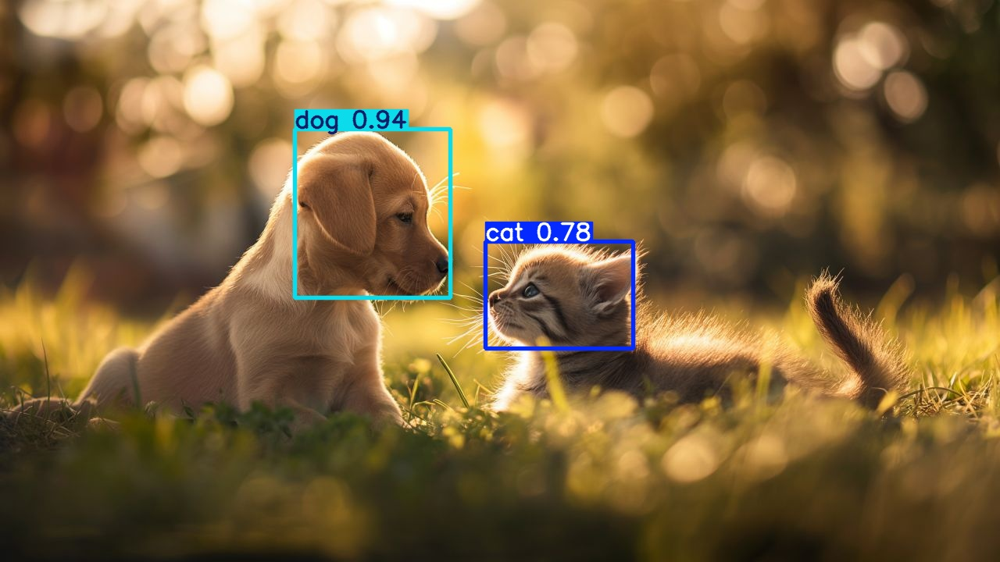

# 🐶🐱 Cat and Dog Detection using YOLOv11

This project implements an Object Detection model to identify Cats and Dogs using the **YOLOv11 Nano** architecture (`yolo11n`) by Ultralytics. It includes scripts for training the model on custom data and running inference on images/videos.

## Project Structure

```text
cat-and-dog-detection-yolo/
├── config.yaml          # Dataset configuration file
├── train.py             # Script to train the model
├── test.py              # Script to run inference/prediction
├── yolo11n.pt           # Pre-trained YOLOv11 Nano weights
├── test_images.jpg      # Input image for testing
├── test_video.mp4       # Input video for testing
└── runs/                # Output directory (logs, weights, results)
    └── detect/
        ├── train/       # Training checkpoints and logs
        └── predict/     # Inference results
            └── test_images.jpg
```
## Installation
1. Clone the repository
2. Install the required dependencies: This project requires Python 3.8+ and the ultralytics package.

```Bash
pip install ultralytics
```

## Usage
### 1. Training (Skippable)
To train the model using the configuration specified in `config.yaml` and the `yolo11n.pt` weights, run `train.py` after having added your local dataset.

The dataset I used to train: `https://www.kaggle.com/datasets/andrewmvd/dog-and-cat-detection` (The first 70% are used to train, the rest are used for validation)


### 2. Inference (Testing)
To run detection on `test_images.jpg` or `test_video.mp4`, run `test.py`. The results will be automatically saved to runs/detect/predict/.

### 3. Detection Results
Below is the result generated by the model. The bounding boxes indicate detected classes (cat/dog) with their confidence scores.



(Note: This image corresponds to the file located at runs/detect/predict/test_images.jpg generated after running the test script.)
